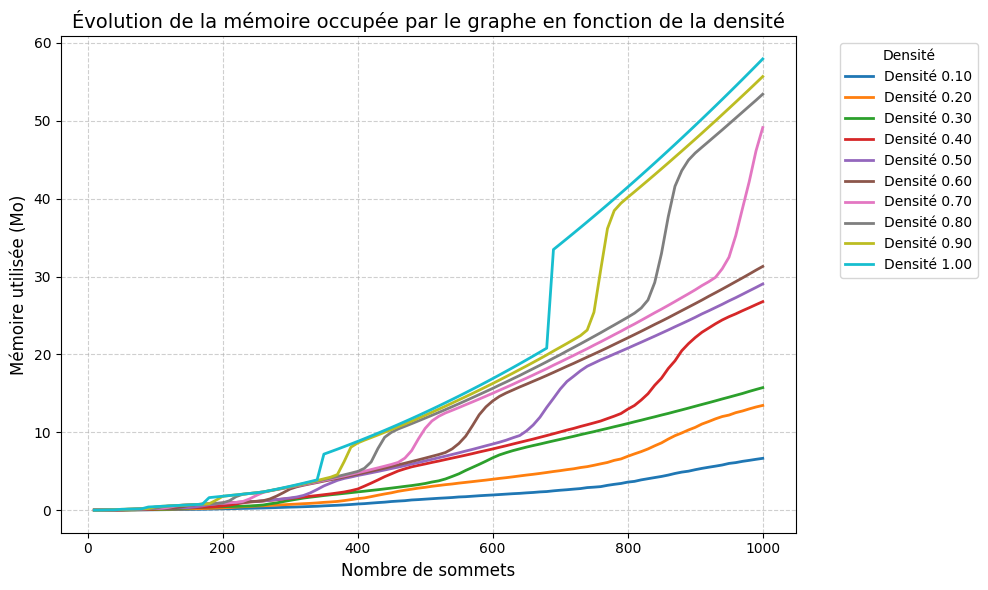

## 📝 Livrable 1 – Modélisation et proposition d’algorithme

---

## Sommaire

- [📝 Livrable 1 – Modélisation et proposition d’algorithme](#-livrable-1--modélisation-et-proposition-dalgorithme)
- [Sommaire](#sommaire)
  - [1. Résumé du projet](#1-résumé-du-projet)
  - [2. Choix d’un type d’algorithme de base](#2-choix-dun-type-dalgorithme-de-base)
  - [3. Définition des contraintes choisies](#3-définition-des-contraintes-choisies)
    - [1. Coût ou restriction de passage sur certaines arêtes](#1-coût-ou-restriction-de-passage-sur-certaines-arêtes)
    - [2. Routes dynamiques ou perturbations](#2-routes-dynamiques-ou-perturbations)
  - [4. Structure des graphes](#4-structure-des-graphes)
    - [1. Stockage du graphe](#1-stockage-du-graphe)
    - [2. Stockage des poids des arêtes](#2-stockage-des-poids-des-arêtes)
    - [3. Exemple](#3-exemple)
    - [4. Impact sur la mémoire](#4-impact-sur-la-mémoire)
  - [5. Pseudo-code de l&#39;algorithme](#5-pseudo-code-de-lalgorithme)
  - [6. Explication de l’algorithme (avec un exemple visuel)](#6-explication-de-lalgorithme-avec-un-exemple-visuel)
    - [Principe général](#principe-général)
    - [Ce que ça apporte](#ce-que-ça-apporte)
    - [Exemple visuel](#exemple-visuel)
  - [7. Calcul de complexité de l’algorithme](#7-calcul-de-complexité-de-lalgorithme)
    - [Étapes de l&#39;algorithme et leur complexité](#étapes-de-lalgorithme-et-leur-complexité)
    - [Nombre total de paliers de refroidissements](#nombre-total-de-paliers-de-refroidissements)
    - [Complexité globale](#complexité-globale)
  - [8. Conclusion](#8-conclusion)

---

### 1. Résumé du projet

Dans le cadre de l’appel à manifestation d’intérêt de l’ADEME, notre équipe **CesiCDP** développe une solution intelligente visant à **optimiser les tournées de livraison** de biens ou services dans un environnement urbain complexe. L’objectif est de **réduire les déplacements** et la **consommation énergétique** tout en prenant en compte des contraintes réalistes et dynamiques du terrain : **routes fermées**, **ralenties**, ou **évoluant dans le temps**.

Nous modélisons ce problème sous forme d’un graphe pondéré représentant un réseau routier. Notre approche repose sur une méthode **approchée**, capable de s’adapter à des situations dynamiques et incomplètes, et d’obtenir de **bonnes solutions rapidement** sans garantie d’optimalité.

---

### 2. Choix d’un type d’algorithme de base

Le problème que nous traitons est une **généralisation du Problème du Voyageur de Commerce (TSP)**, qui est un **problème NP-difficile**. Trouver une solution optimale est irréaliste pour de grands réseaux. Nous avons donc opté pour une **métaheuristique**, plus précisément le **Recuit Simulé** (Simulated Annealing), pour plusieurs raisons :

- Il s’adapte bien à la recherche dans un espace de solutions complexe.
- Il peut gérer des **coûts variables et des contraintes dynamiques**.
- Il offre un bon **compromis entre performance et qualité de solution**.

---

### 3. Définition des contraintes choisies

#### 1. Coût ou restriction de passage sur certaines arêtes

Certaines routes peuvent :

- Être **bloquées** (travaux, incidents, accès interdit),
- Être **coûteuses** (péages, pollution, montée, zone à trafic dense).

Modélisation :

- Si une route est **bloquée** : `c(e) = -1`
- Si elle est **coûteuse** : `c(e)` est plus élevé que le reste

#### 2. Routes dynamiques ou perturbations

Les **coûts des routes peuvent évoluer dans le temps** en raison de :

- Variation du trafic (heures de pointe),
- Météo ou incidents,
- Changement de règles de circulation.

Modélisation :

- Chaque arête `(i, j)` a un coût `c_{i,j}(t)` dépendant du **temps** ou d’une **fonction aléatoire/déterministe** simulée.

---

### 4. Structure des graphes

Pour stocker le graphe et ses poids, on utilise une structure de données qui permet de représenter les arêtes et leurs coûts de manière flexible. Voici comment on peut organiser cela :

#### 1. **Stockage du graphe**

Le graphe est généralement représenté sous forme de **dictionnaire de dictionnaires** où chaque clé est un sommet, et la valeur associée est un autre dictionnaire représentant les voisins de ce sommet avec le poids de l'arête les reliant.

- **Exemple** :

  ```python
  poids_arêtes = {
      1: {2: 10, 3: 20},  # Sommet 1, poids des arêtes vers 2 et 3
      2: {1: 10, 3: 5},   # Sommet 2, poids des arêtes vers 1 et 3
      3: {1: 20, 2: 5}    # Sommet 3, poids des arêtes vers 1 et 2
  }
  ```

#### 2. **Stockage des poids des arêtes**

Les poids des arêtes sont stockés en fonction de deux facteurs principaux :

- **Distance physique** ou **temps de trajet** : le coût de base entre deux sommets.
- **Facteur de ralentissement** : si la route est ralentie (par exemple, travaux ou trafic), on applique un facteur pour ajuster le poids de l'arête.
- **Restrictions de passage** : certaines routes peuvent être bloquées ou interdites, et dans ce cas, le poids est défini comme étant égal à  `-1`, rendant l'arête inaccessible.

**Exemple de poids** :

- Si la distance entre les sommets `1` et `2` est de 10, avec un facteur de ralentissement de 2 (trafic ralenti), le poids sera `10 * 2 = 20`.
- Si une route entre `2` et `3` est bloquée, le poids sera `-1` pour indiquer que cette route ne peut pas être utilisée.

#### 3. Exemple

```python
poids_arêtes = {
    1: {2: 20, 3: 40},  # Poids entre 1 et 2 (ralenti) et entre 1 et 3
    2: {1: 20, 3: -1},  # Route bloquée entre 2 et 3
    3: {1: 40, 2: -1}   # Route bloquée entre 3 et 2
}
```

#### 4. Impact sur la mémoire

L'objectif de cette étude est de tester l'impact de la densité d'un graphe et du nombre de sommets sur sa consommation mémoire. Le graphe est représenté sous forme de dictionnaire de dictionnaires, où chaque sommet pointe vers un sous-dictionnaire représentant ses voisins et les poids des arêtes les reliant.

Le code génère des graphes avec des tailles croissantes et des densités variables. Pour chaque combinaison de taille (nombre de sommets) et de densité (proportion d'arêtes possibles), le graphe est créé aléatoirement avec des poids sur les arêtes. La mémoire utilisée par chaque graphe est ensuite mesurée en bytes et convertie en mégaoctets à l'aide de la bibliothèque pympler.

Les résultats sont collectés et affichés sous forme de graphique, où l'axe des X représente le nombre de sommets, et l'axe des Y représente la mémoire utilisée. La densité du graphe est affichée sous forme de courbes, permettant d'observer l'évolution de la consommation mémoire en fonction de la densité et de la taille du graphe.

L'étude permet ainsi de visualiser l'impact de la densité des arêtes sur la consommation mémoire, offrant des insights utiles pour l'optimisation de l'utilisation de la mémoire dans des applications manipulant des graphes.



### 5. Pseudo-code de l'algorithme

Voici le **pseudo-code** de l'algorithme de Recuit Simulé avec contraintes dynamiques :

```plaintext
Entrée :
    - G(V, E) : graphe routier avec arêtes pondérées (poids = coût dynamique)
    - s ∈ V : sommet de départ
    - T_init : température initiale
    - T_min : température minimale
    - α ∈ (0,1) : facteur de refroidissement
    - N : nombre maximal d'itérations à température constante

Fonctions :
    - compute_cost(tour, G, t) : retourne le coût total de la tournée à l’instant t
        (en tenant compte des routes bloquées et des ralentissements dynamiques)
    - is_valid(tour, G, t) : retourne Vrai si aucune arête bloquée (c = -1) n’est utilisée
    - generate_neighbor(tour) : génère une nouvelle tournée en permutant deux villes

Algorithme :

Début :
    t ← 0                         // temps initial
    T ← T_init                    // température initiale
    current_tour ← tournée aléatoire valide depuis s
    best_tour ← current_tour
    best_cost ← compute_cost(best_tour, G, t)

    Tant que T > T_min :

        update_graph(G, t)       // Mettre à jour les poids du graphe selon les conditions actuelles

        Pour i de 1 à N :
            neighbor ← generate_neighbor(current_tour)
  
            Si is_valid(neighbor, G, t) :
                cost_neighbor ← compute_cost(neighbor, G, t)
                cost_current ← compute_cost(current_tour, G, t)

                Δ ← cost_neighbor - cost_current

                Si Δ < 0 :
                    current_tour ← neighbor
                    Si cost_neighbor < best_cost :
                        best_tour ← neighbor
                        best_cost ← cost_neighbor
                Sinon :
                    p ← exp(-Δ / T)
                    Si random(0,1) < p :
                        current_tour ← neighbor

        T ← α × T     // refroidissement
        t ← t + 1     // temps évolue → simulateur de trafic évolue aussi

Retourner best_tour
```

---

### 6. Explication de l’algorithme (avec un exemple visuel)

Nous utilisons un algorithme de **recuit simulé** pour résoudre notre problème de tournées optimales dans un contexte **dynamique** : les conditions de circulation peuvent évoluer à tout moment (ralentissements, blocages, changements de coût…).

#### Principe général

1. **Initialisation** :On commence par une **tournée initiale valide**, calculée à partir des conditions connues au temps `t = 0`.
2. **Recherche locale guidée** :À chaque température `T`, l’algorithme génère plusieurs **solutions voisines** (par exemple, en échangeant deux points de livraison dans la tournée).
3. **Critère d’acceptation** :

   - Si une solution est **meilleure** (coût total plus faible), elle est acceptée.
   - Si elle est **moins bonne**, elle peut être acceptée **avec une probabilité** dépendante de la température. Cela permet de **s’échapper des minima locaux**.

   La probabilité d’accepter une mauvaise solution diminue au fil du temps.
4. **Refroidissement progressif** :La température est réduite itérativement (par un facteur de refroidissement `α < 1`), ce qui rend l’algorithme **de plus en plus strict**.
5. **Mise à jour dynamique des conditions** :À chaque itération, on **modifie les poids (ou l’accessibilité) des routes** selon un simulateur de trafic. Cela permet de prendre en compte les perturbations (route bloquée, coût augmenté, etc.).
6. **Résultat final** :
   L’algorithme retourne **la meilleure tournée rencontrée** durant toute la recherche.

#### Ce que ça apporte

Le recuit simulé est **robuste aux changements** et **adapté à des environnements incertains**. Il ne garantit pas l’optimum global, mais fournit de très bonnes solutions en un temps raisonnable, **même avec des contraintes complexes et variables**.

---

#### Exemple visuel

Le GIF ci-dessous illustre comment le recuit simulé affine progressivement une tournée.
Les points représentent des villes, et la ligne la tournée actuelle.
Au début, la solution est chaotique, puis elle devient plus structurée à mesure que l’algorithme refroidit.


Une fois l'algorithme terminé, voici la tournée finale optimisée :


**Source :** MathWorks Pick of the Week — *Will Campbell*

---

### 7. Calcul de complexité de l’algorithme

L’algorithme de **Recuit Simulé** repose sur deux niveaux de boucle :

1. Une boucle externe de **refroidissement** (tant que `T > T_min`)
2. Une boucle interne de **recherche locale** sur `N` voisins

---

#### Étapes de l'algorithme et leur complexité

À **chaque température**, on fait :

1. `update_graph(G, t)`→ met à jour les poids des arêtes dynamiques→ **O(|E|)**
2. `N` itérations de :

   - `generate_neighbor(tour)` → **O(1)**
   - `is_valid(tour)` → **O(n)**
   - `compute_cost(tour)` → **O(n)**

Chaque itération de voisin coûte donc **O(n)**
→ Et la boucle interne coûte **O(N × n)**

**Coût total par palier :**

$$
\mathcal{O}(|E| + N \cdot n)
$$

---

#### Nombre total de paliers de refroidissements

La température est mise à jour comme `T ← α × T` à chaque itération.
Le nombre de paliers est donc :

$$
k \approx \log_{\alpha} \left(\frac{T_{\text{min}}}{T_{\text{init}}}\right) = \frac{\log(T_{\text{min}} / T_{\text{init}})}{\log(\alpha)} = \frac{\log(T_{\text{init}} / T_{\text{min}})}{-\log(\alpha)}
$$

Donc on peut simplifier à :

$$
k = \mathcal{O}\left(\log\left(\frac{T_{\text{init}}}{T_{\text{min}}}\right)\right)
$$

---

#### Complexité globale

L’algorithme effectue `k` paliers, et chaque palier coûte :

$$
\mathcal{O}(|E| + N \cdot n)
$$

Donc la **complexité globale est :**

$$
\mathcal{O}\left(\log\left(\frac{T_{\text{init}}}{T_{\text{min}}}\right) \cdot (|E| + N \cdot n)\right)
$$

---

### 8. Conclusion

- Si le graphe est **dense** (graphe complet), alors |E| ≈ n², donc complexité ≈ **O(n²)**
- Si le graphe est **clairsemé**, alors |E| ≈ n, donc complexité ≈ **O(n)**
- Le facteur logarithmique est modéré (quelques dizaines en pratique)
- Le paramètre `N` est contrôlable (par exemple N = 100 ou 500)

**Complexité globale simplifiée :**

$$
\mathcal{O}\left(\log\left(\frac{T_{\text{init}}}{T_{\text{min}}}\right) \cdot \max(|E|, N \cdot n)\right)
$$

---
